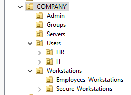
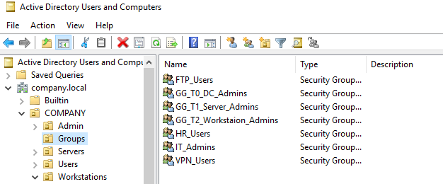
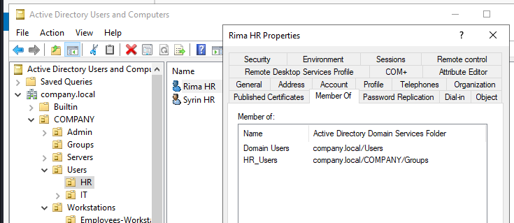

# Active Directory & Identity

## OU Structure
Full COMPANY organizational unit tree — Users, Computers, Servers, Groups.

---

## Security Groups
HR_Users, IT_Admins, VPN_Users, FTP_Users inside COMPANY\Groups.

---

## User Group Membership
Example showing a user's Member Of tab with their assigned group.

