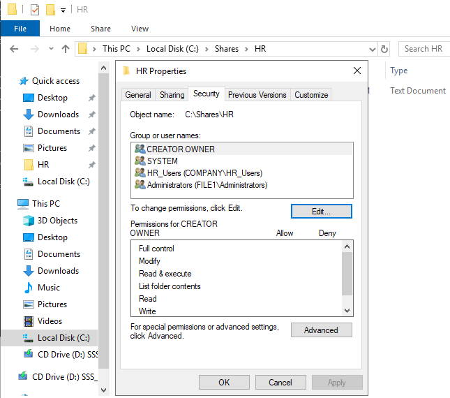
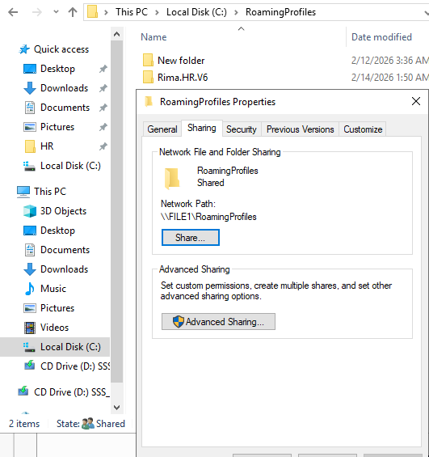
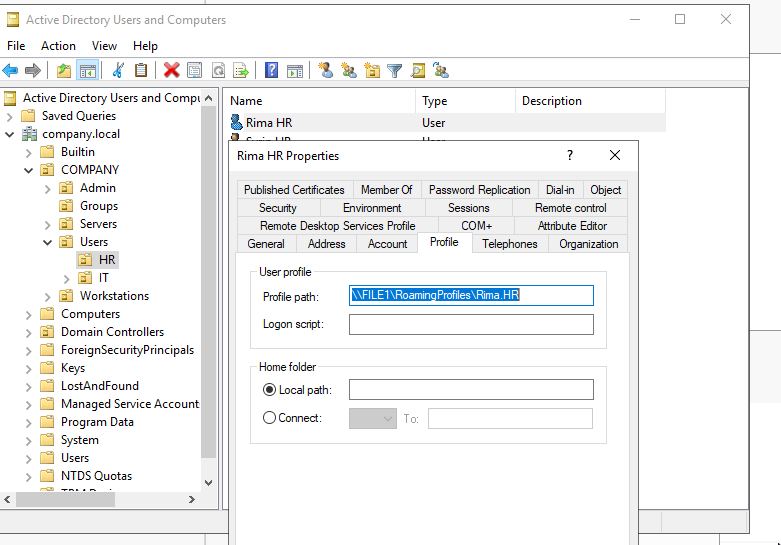

# File Server — FILE1

## NTFS Permissions
HR folder showing HR_Users group with Modify permission.
Inheritance disabled — permissions are explicit and AD group-based.

---

## Roaming Profiles Share
RoamingProfiles folder shared on FILE1 with Authenticated Users.

---

## User Profile Path
User profile path set in ADUC pointing to \\FILE1\RoamingProfiles\%username%

