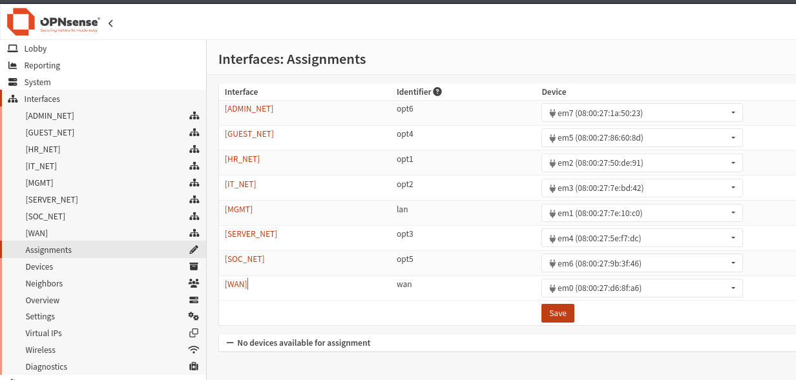
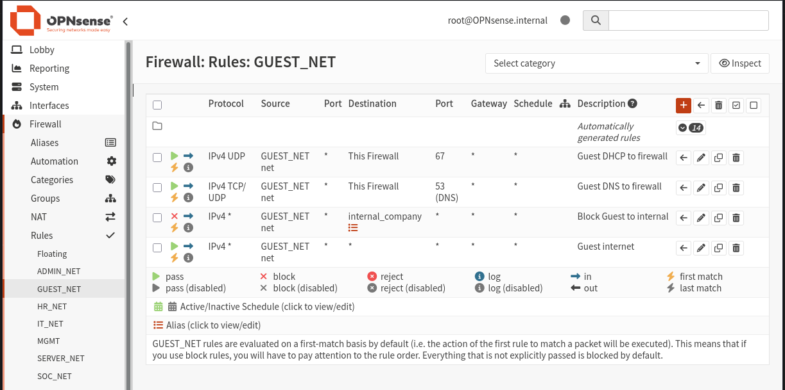
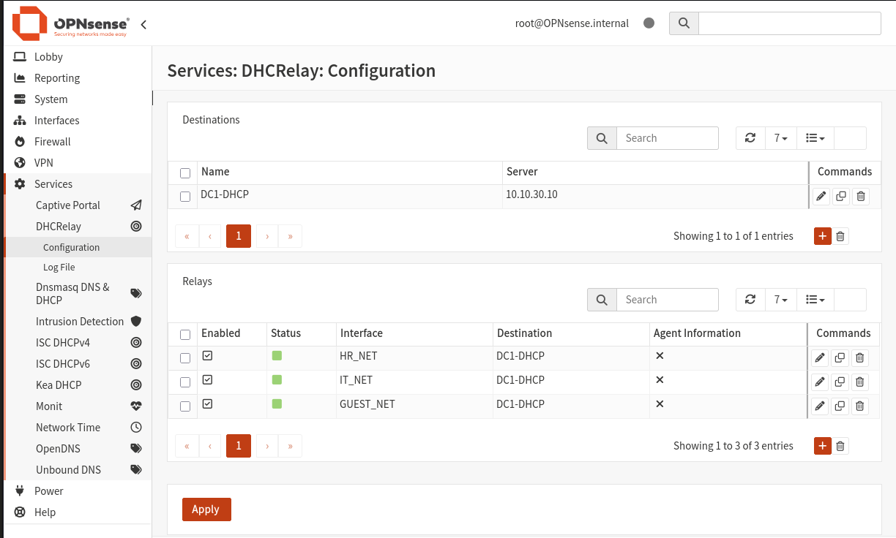
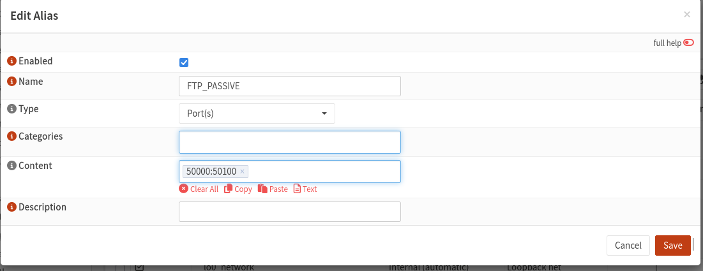

# Firewall — OPNsense Configuration

## Interface Assignments
All 6 network adapters assigned and named in OPNsense. (SOC-NET and ADMIN_NET were used in phase two of this project )

---

## GUEST Firewall Rules
4 rules in strict order — DHCP, DNS, block internal, allow internet.

---

## DHCP Relay
OPNsense relaying DHCP requests from HR, IT and GUEST to DC1.

---

## FTP Passive Alias
Alias FTP_PASSIVE covering ports 50000–50100 used in FTP rules.

