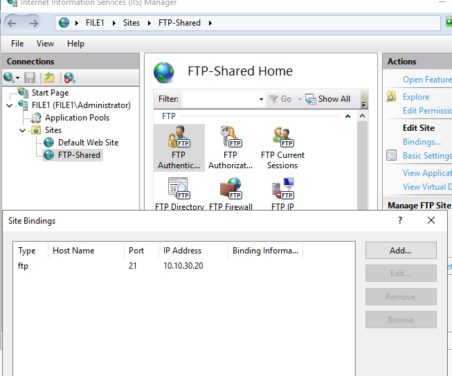
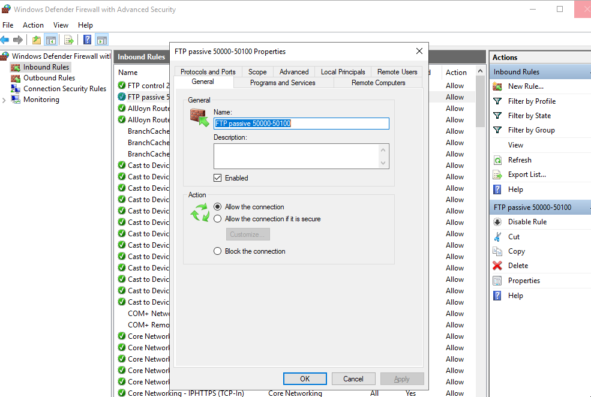

# FTP Server — FILE1 / IIS

## FTP Site Configuration
IIS FTP site bound to 10.10.30.20 port 21 — AD group authentication,
FTP_Users authorized, Read and Write permissions.

---

## Windows Firewall Rules
Inbound rules allowing TCP port 21 and passive range 50000–50100.

